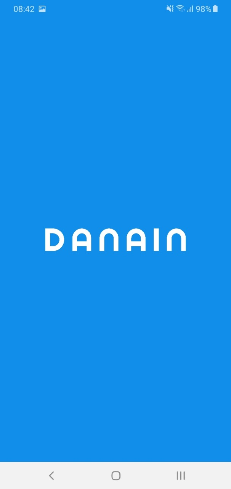
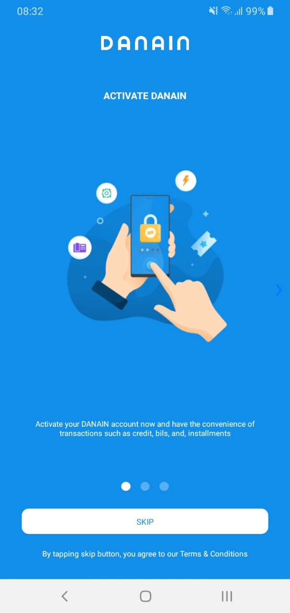
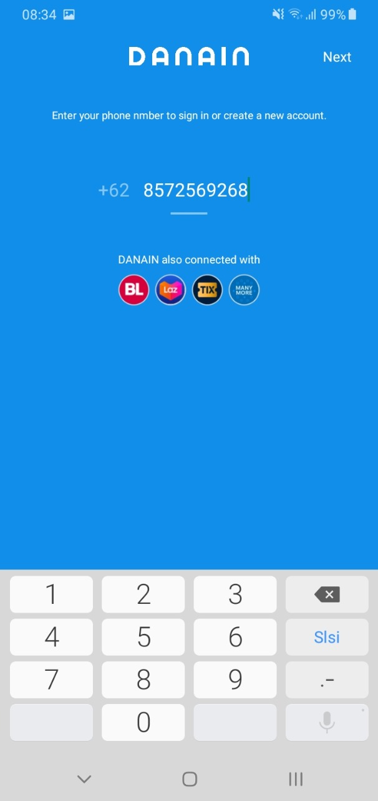

<h1 align="center">Clone DANAIN Apps</h1>

  

  

## Related Project
Frontend React Native (https://github.com/mohammadalviyan/Clone-DANA-App/tree/front_end)

Backend Express Js (https://github.com/mohammadalviyan/Clone-DANA-App/tree/back_end)

Admin Panel (https://github.com/mohammadalviyan/Clone-DANA-App/tree/admin_panel)

## Introduction

DANAIN is an application engaged in fintech. Has several services that make it easy for users to transact non-cash / digital.

## Requirements
  - NPM (Node Package Manager)
  - React-Native
  - Express Js

## Screenshot
  

    
      &nbsp;&nbsp;&nbsp;
      
    

  

  

    
       
    
  

  

    
       
    
  

## Contributors

<table border="0">
  <tr>
    <td align="center">
      <a href="https://github.com/Derida23">
         
          <b>Arian Derida S</b>
      </a>
    </td>
    <td align="center">
      <a href="https://github.com/ditanh97">
         
          <b>Dita Nurhalimah</b>
      </a>
    </td>
    <td align="center">
      <a href="https://github.com/nhasoenhasan">
         
          <b>Nur Hasan</b>
      </a>
    </td>
    <td align="center">
      <a href="https://github.com/mohammadalviyan">
         
          <b>Mohammad Alviyan Anwari</b>
      </a>
    </td>
  </tr>
</table>